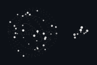
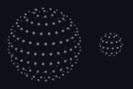
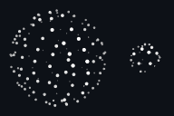
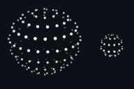
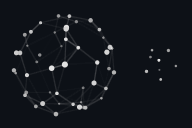
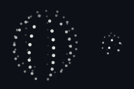
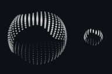
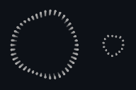
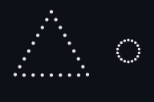
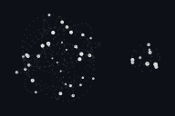

# ThinkingOrbKit

Dotted, depth-shaded 3D "thinking" indicators for SwiftUI — nine hand-tuned
animations, drawn with a `Canvas` inside a `TimelineView`. No assets, no
dependencies.

A Swift port of [thinking-orbs](https://github.com/Jakubantalik/thinking-orbs) by Jakub Antalik
(MIT). The geometry engine is a line-for-line port of the TypeScript one and is
verified against its own output (see [Testing](#testing)).

**Requires** iOS 15+ / macOS 12+, Swift 6 toolchain.

<table>
  <tr>
    <td align="center"><br><code>.working</code></td>
    <td align="center"><br><code>.searching</code></td>
    <td align="center"><br><code>.solving</code></td>
  </tr>
</table>

<table>
  <tr>
    <td align="center"><br><code>.listening</code></td>
    <td align="center"><br><code>.connecting</code></td>
    <td align="center"><br><code>.weaving</code></td>
  </tr>
</table>

<table>
  <tr>
    <td align="center"><br><code>.composing</code></td>
    <td align="center"><br><code>.breathing</code></td>
    <td align="center"><br><code>.shaping</code></td>
  </tr>
</table>

<sub>Each preview shows the two hand-tuned sizes side by side — <code>.px64</code> on the left, <code>.px20</code> on the right. Rendered straight from the engine; regenerate with <code>Scripts/render-gifs.sh</code>.</sub>

## Use it

```swift
import ThinkingOrbKit

ThinkingOrb(state: .searching)                       // 64 pt
ThinkingOrb(state: .working, size: .px20)            // sits inline with text
ThinkingOrb(state: .shaping, theme: .dark, speed: 1.5)

HStack {
    ThinkingOrb(state: .composing, size: .px20)
    Text("Composing…")
}
```

| Parameter | Default | |
|---|---|---|
| `state` | `.working` | which animation (table below) |
| `size` | `.px64` | `.px64` (avatar) or `.px20` (inline) — the two hand-tuned designs — or any size, e.g. `size: 40` (see below) |
| `theme` | `.auto` | `.auto` follows the color scheme; `.dark` / `.light` pin it |
| `speed` | `1` | multiplier on the preset's baked speed |
| `paused` | `false` | freeze on the current frame |
| `transition` | `.morph()` | what happens when `state` changes: morph seamlessly, or `.none` to switch instantly |

| State | Animation |
|---|---|
| `working` | particles on tilted orbits |
| `searching` | a scan meridian sweeps a dotted globe |
| `solving` | bands scramble in quarter turns, then click back |
| `listening` | a waveform rolls through latitude rings |
| `connecting` | a constellation wires itself, packets running the edges |
| `weaving` | three strands plait around the sphere |
| `composing` | an undulating multi-band sash |
| `breathing` | a face-on ring slowly morphing |
| `shaping` | a dotted outline morphs circle → triangle → square |

### Custom sizes

`size` takes `.px64`, `.px20`, or any number:

```swift
ThinkingOrb(state: .working, size: 40)            // literal
ThinkingOrb(state: .working, size: OrbSize(40))   // explicit
```

Only 64 pt and 20 pt are hand-tuned — separate designs with their own dot count,
dot size and speed, not a scale factor. Other sizes are derived from them:

- **20–64 pt:** the two tunings are blended (geometrically for the multipliers,
  in log-size), so 40 pt sits smoothly between the two looks.
- **Below 20 / above 64:** the nearest tuning is used as is, at the size you ask
  for. Dot radii scale sub-linearly with size, so small orbs stay legible, but
  these sizes are not hand-tuned: large orbs look sparser and chunkier than the
  64 pt design, tiny ones coarser. Sizes below 1 pt are raised to 1.

### Morphing between states

Change `state` and the orb morphs seamlessly into the new one:

<p align="center">
  
</p>

```swift
ThinkingOrb(state: state)                                    // morphs (the default)
ThinkingOrb(state: state, transition: .morph(duration: 1.5)) // slower
ThinkingOrb(state: state, transition: .none)                 // switch instantly
```

Every dot of the old state flows into a dot of the new one, changing position,
size and ink on the way, while both animations keep running. States have
different numbers of dots (24 up to 566), so where the counts differ, extra dots
split off from — or merge into — their neighbours. Dots are paired by where they
are on screen, so they travel short distances and the morph reads as a flow, not
a scramble.

Changing state again mid-morph starts the next one from exactly what is on
screen, so nothing jumps. Nothing morphs on first appearance, when `size`
changes, while the orb is `paused`, or with **Reduce Motion** on — those switch
instantly.

Behaviour worth knowing:

- Every orb shares one clock, so several on screen stay in phase.
- `TimelineView` pauses itself while the orb is off-screen.
- With **Reduce Motion** on, an orb shows a single still frame.
- Each orb is an accessibility image labelled with its state (`"Searching…"`).

## Add it to a project

Xcode: *File ▸ Add Package Dependencies… ▸ Add Local…* and pick this folder, or
in `Package.swift`:

```swift
.package(path: "../ThinkingOrbKit")
// …
.product(name: "ThinkingOrbKit", package: "ThinkingOrbKit")
```

## Testing

```sh
swift test
```

`Tests/…/Resources/orbs-golden.json` is the reference output of the original
TypeScript engine: every dot and line for 9 states × 2 sizes × 4 timestamps,
plus each preset's resolved options. The tests require the Swift engine to match
it to within 1e-4 (the file itself is rounded to 6 decimals). The other tests
pin the worked examples written into the source comments, check that the depth
sort is stable, and check that morphs are seamless: they begin and end on exactly
the frames they connect, every dot is accounted for, and no dot ever jumps.

The engine (`Sources/ThinkingOrbKit/Engine`) is internal on purpose. Only
`ThinkingOrb`, `OrbState`, `OrbSize` and `OrbTheme` are public.

## License

MIT — see [LICENSE](LICENSE). Original work © 2026 Jakub Antalik; Swift port © 2026 AmirHossein EramAbadi ( persuara ).
